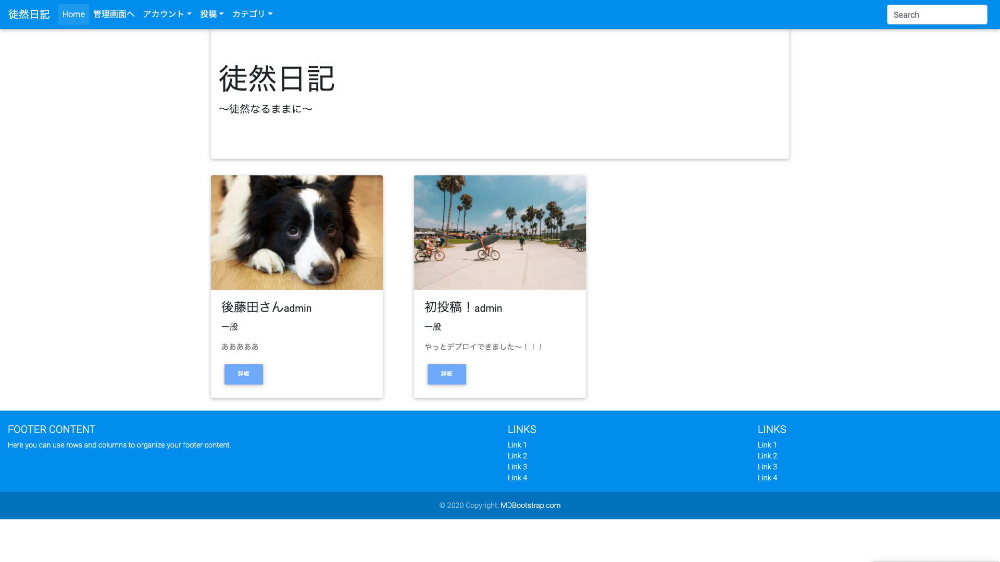

# 日記投稿アプリを作成しました（制作期間5日）。

Python、Django、Bootstrapを使用したくて、グーグル検索、udemy検索しながら作成しました。
https://tsuretsure.herokuapp.com/

###### ①画面キャプチャ

###### ②ジャンケンページキャプチャ

## 使用技術
Python、Django、Bootstrap、Aws s3、Heroku

## 工夫した点
①AWS S3を使用した画像表示
②お気に入り機能
③カテゴリー追加/分類
④検索機能
⑤アカウント別画面の作成

## 所感および苦労した点
初pythonの為、一から調べて作成しました。Djangoを使えば、お気に入り機能、カテゴリー分類等が簡単に実装できるのに驚きました。また、bootstrapを使えば、簡単に整った見た目にできることも驚きです。正直、「こんな感じか〜」っていう程度の理解で、全く消化できたないので、時間をかけて理解したいと思います。
一番、大変だったのはherokuへのアップロードでした。3日くらいかけて、アップデートできず、挫けそうになりましたが、何とかデプロイできました（エラー原因は、タイポでした、、、、）、
